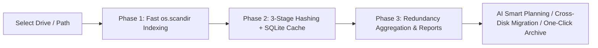
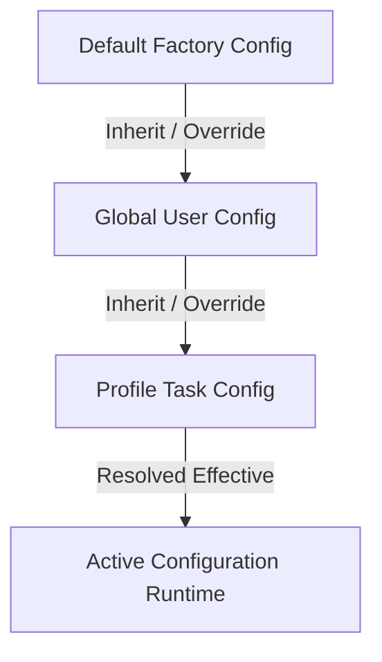

# 🚀 Disk Space Panorama Analyzer & AI Smart File Organizer

[](https://www.python.org/downloads/)
[](https://pypi.org/project/PySide6/)
[](https://opensource.org/licenses/MIT)
[](https://www.microsoft.com/windows)
[](https://github.com/xuemingze/disk-space-analyzer)

> **High-Performance Desktop Client for Windows Disk Space Analysis & AI Governance**: Features a 3-Phase Asynchronous Non-blocking Scan Engine, Persistent SQLite Hash Cache, 3-Tier Configuration Inheritance, **App/Toolchain Atomic Directory Grouping**, **Smart Migration with Windows Shortcut & Registry Synchronization and Rollback Manifests**, and an **End-to-End Anti-Hallucination AI Deep Analysis & Automated Execution Pipeline**.

[English Documentation](./README.md) | [中文文档](./README_ZH.md)

---

## 🌟 Key Highlights & Architecture

### 1. ⚡ 3-Phase Non-Blocking Asynchronous Scan Engine
- **Phase 1 (Instant Scan & Visual Snapshot)**: Leverages streaming `os.scandir` to render donut/bar space distribution charts, file categories, and **Global Top 100 Large Files Table** within seconds.
- **Phase 2 (Concurrent Chunked Hashing & Duplication Detection)**:
  - Innovative 3-stage filtration: `File Size -> 8KB Head Sample Hash -> Full File Hash`.
  - Backed by persistent **SQLite Hash Cache**, making subsequent scans almost instantaneous.
  - Safe 64-bit integer calculations for multi-terabyte files without overflow errors.
- **Phase 3 (Redundancy Aggregation & LLM Report)**: Combines duplicate copies with heuristic redundant patterns and generates structured Markdown governance reports via OpenAI-compatible APIs.



---

### 2. 🛡️ Custom Ignore Folders & Path Filter Management
- **Flexible Management**: Add paths directly via folder browser or manual absolute path entry.
- **Rich Interaction**: Double-click to edit, batch multi-selection delete, one-click clear, and contextual right-click menu (copy full path, open directly in Windows File Explorer).
- **Runtime Filtering**: Automatically excludes configured directories and their sub-items during scan execution while displaying skipped folder counts to protect critical workspaces and private directories.

---

### 3. 🌳 App / Toolchain Atomic Directory Grouping
- **No mechanical splitting by file extensions**: Toolchains and application directories (e.g. `~/npm`, `~/.npm`, `node_modules`, `pip\cache`, `VS Code`, `Docker`, `WeChat`, `.gradle`, `.cargo`) are treated as **Atomic Treatment Units**.
- **10-Column Comprehensive Tree Plan Dashboard (`QTreeWidget`)**:
  - Displays Directory/File Unit, App/Tool (with `[AI]` or `[Offline Rule]` badge), Suggested Category, Planned Target Path, Rationale, Count/Size, Confidence, Risk Level, Action (Clean / Archive), and **Task & Report Audit Linkage (`R:report_id | T:task_id`)**.
  - Multi-level parent-child checkbox synchronization (`Checked` / `PartiallyChecked` / `Unchecked`).
  - Quick filters for **"🛡️ Select Safe Recommended Items Only"**.
- **Symlink & NTFS Junction Detection**: Identifies Windows Junction points to prevent circular traverses.
- **Conservative Fallback**: Unrecognized directories are assigned to `"Unrecognized Tool / Pending Review"` and marked as requiring manual confirmation.

---

### 4. 🤖 AI Deep Analysis & Automated Execution Pipeline
- **Broad API Compatibility**: Connects to OpenAI, DeepSeek, MiniMax, Qwen, Local Ollama, and any OpenAI-compatible API endpoint.
- **Automated Audit & Report Traceability**: Automatically injects scan task IDs and timestamps into the LLM prompt, generates a comprehensive Markdown report, and exports it locally (`AI深度分析报告_{id}.md`).
- **Report-Driven Action Extraction**: Submits the generated Markdown report directly to the LLM to extract a structured directory organization plan.
- **Anti-Hallucination & Robust Response Cleaning**: Built-in regex sanitizer removes `<think>...</think>` tags and markdown wrappers to prevent JSON parse errors.
- **Strict Field-Level Validation**: Enforces mandatory validation on returned plans, rejecting malformed structures before they reach the GUI.
- **Exponential Backoff & Jitter Retry**: Resilient against network fluctuations and read timeouts with staged backoff retries.

---

### 5. 📦 Smart Migration, NTFS Junction Links & Atomic Rollback
- **NTFS Junction Links (`mklink /J`)**: Move bulky games or work directories across drives while maintaining seamless software accessibility.
- **Selective Shortcut & Registry Synchronization**:
  - Automatically identifies associated Desktop and Start Menu `.lnk` shortcuts.
  - Detects `HKCU` / `HKLM` registry paths, allowing users to review and selectively update paths.
- **Atomic Rollback & Manifest Credentials**:
  - Automatically triggers rollback to restore moved files if an unexpected error occurs during migration.
  - Saves full JSON mapping manifests in `~/.disk_space_analyzer/archive_manifests/` for one-click rollback.

---

### 6. ⚙️ 3-Tier Configuration Inheritance

- Hierarchical cascading resolution (`Default -> Global -> Profile`) with visual badge indicators in the GUI (`[Default]`, `[Global]`, `[Profile]`).

---

### 7. 🛡️ Zero-Stall Architecture & Background Task Manager
- **Unified Task Center**: Monitors history, stage progression (e.g., aggregating, AI analysis), speeds, and success/failure/skip ratios.
- All disk I/O, hashing, archiving, migration, and LLM requests execute in dedicated background `QThread` workers.
- Real-time throughput metrics: **⚡ Speed (MB/s), Processed Files/Bytes, and ETA**.
- Complete control with **⏸️ Pause, ▶️ Resume, ⏹️ Cancel**.
- Intercepts window close events if tasks are actively running to safeguard disk operations.

---


### 8. 🗂️ Snapshot Management & Intelligent Cleanup
- **History Archive Manager**: Multi-select snapshot deletion, status visualization, and chronological sorting.
- **One-Click Safe Clean**: Securely wipes out fully rolled-back or canceled snapshots without affecting active ones.
- **Incremental UI Refresh**: Real-time localized table and UI updates without triggering heavy full-disk rescans.

### 9. 🎨 Responsive UI & High-DPI Adaptation
- **Adaptive Layouts**: Full support for 125%, 150%, and higher Windows DPI scaling settings.
- **Scrollable Dynamic Areas**: Removes rigid height constraints, letting AI insights and logs expand organically.
- **Targeted AI Extraction**: Smartly parses LLM markdown to display *only relevant sections* (e.g., redundant files vs. large files) on respective tabs, instead of dumping entire reports.

## 📂 Project Directory Structure

```text
Disk-Space-Analyzer/
├── app/
│   ├── config.py                  # 3-Tier Configuration Inheritance Manager (Default/Global/Profile)
│   ├── core/
│   │   ├── ai_service.py          # LLM Client, Report Generator, Sanitizer & Validation
│   │   ├── app_detector.py        # App/Tool Identification & Atomic Directory Grouping
│   │   ├── cleaner.py             # Streaming Archive & Safe Delete Worker
│   │   ├── hash_cache.py          # SQLite Persistent Hash Cache Database
│   │   ├── migrator.py            # Migration, NTFS Junction, Shortcut & Registry Sync
│   │   ├── scanner.py             # 3-Phase Asynchronous High-Performance Scanner (with Ignore Filters)
│   │   └── task_manager.py        # Background Task Scheduler (Speed/ETA/Pause/Resume)
│   ├── ui/
│   │   ├── main_window.py         # Modern Sidebar Main Window
│   │   ├── home_view.py           # Dashboard, Report Panel & Staged Rendering Scan View
│   │   ├── organizer_view.py      # File Organizer & Directory Tree View
│   │   ├── settings_view.py       # Configuration Center & Ignore Folders Management
│   │   ├── styles.py              # Modern Dark Theme QSS Stylesheet
│   │   └── components/
│   │       ├── data_table.py      # O(1) Checkbox High-Performance Data Table
│   │       ├── migration_dialog.py# Smart Migration & Registry/Shortcut Sync Wizard
│   │       ├── organize_dialog.py # QTreeWidget 10-Column Directory Tree Plan Dialog
│   │       └── task_manager_widget.py # Background Task Monitor & Log Dialog
│   └── utils/
│       ├── file_helper.py         # System Protected Whitelist & Size Formatter
│       └── logger.py              # Application Logging System
├── tests/
│   ├── test_ai_service_and_pipeline.py  # AI Sanitization, Validation & Retry Tests
│   ├── test_app_detector_and_grouping.py# Toolchain Grouping & ~/npm Verification
│   ├── test_gui_dialogs.py             # Headless Qt Tree Dialog Verification
│   ├── test_null_safety.py             # Null Safety & Edge Case Protection Tests
│   └── test_settings_and_ignore_folders.py # Settings Persistence & Ignore List Tests
├── main.py                        # Application Entrypoint
├── requirements.txt               # Dependencies
├── README.md                      # English Documentation
└── README_ZH.md                   # Chinese Documentation
```

---

## 🚀 Quick Start

### 1. Requirements & Setup
Python 3.10 or higher is recommended:
```bash
# 1. Clone the repository
git clone https://github.com/xuemingze/disk-space-analyzer.git
cd disk-space-analyzer

# 2. Create and activate virtual environment (Recommended)
python -m venv .venv
.venv\Scripts\activate

# 3. Install dependencies
pip install -r requirements.txt
```

### 2. Launch GUI Application
```bash
python main.py
```

### 3. Run Automated Test Suite
```bash
pytest tests/ -v
```

---

## 🤖 LLM Configuration Guide

Navigate to **"Settings"** in the sidebar:
1. **Base URL**: Enter any OpenAI-compatible API endpoint (e.g. `https://api.openai.com/v1`, DeepSeek, or local Ollama `http://localhost:11434/v1`).
2. **API Key**: Enter your API key.
3. **Model Selection**: Click **"🔄 Fetch Available Models"** to populate available models (e.g. `gpt-4o`, `deepseek-chat`, `MiniMax-Text-01`).
4. **Test & Save**: Click **"⚡ Test Connection"** to verify, then save to Global or Profile configuration.
*(Note: If no API Key is configured, the client automatically and seamlessly falls back to the high-accuracy offline heuristic rule engine).*

---

## 📄 License

This project is licensed under the [MIT License](LICENSE).
