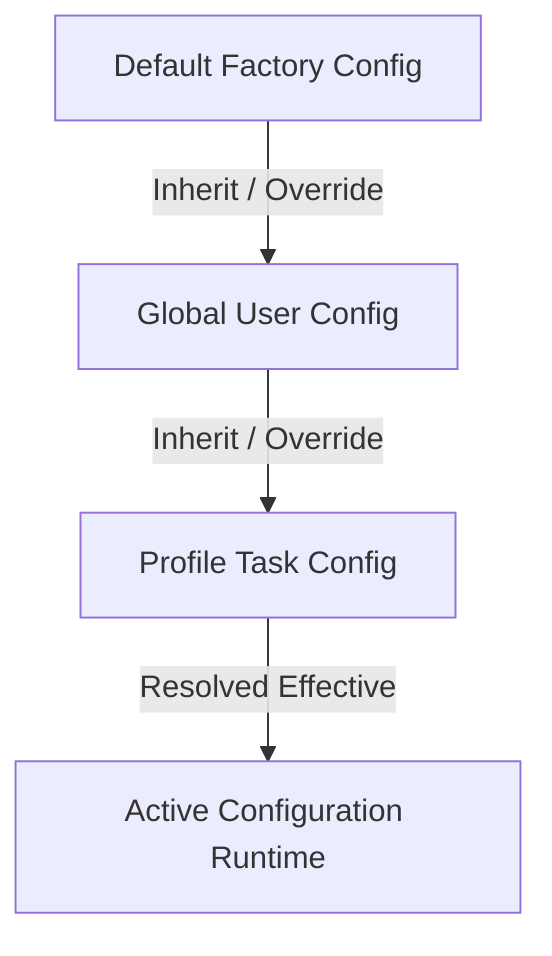

# 🚀 Disk Space Panorama Analyzer & AI Smart File Organizer

[](https://www.python.org/downloads/)
[](https://pypi.org/project/PySide6/)
[](https://opensource.org/licenses/MIT)

> **High-Performance Desktop Client for Windows Disk Space Analysis & AI Governance**: Features a 3-Phase Asynchronous Non-blocking Scan Engine, Persistent SQLite Hash Cache, 3-Tier Configuration Inheritance, **App/Toolchain Atomic Directory Grouping**, and Smart Migration with Automatic Windows Shortcut / Registry Synchronization and Rollback Manifests.

[English Documentation](./README.md) | [中文文档](./README_ZH.md)

---

## 🌟 Key Highlights & Architecture

### 1. ⚡ 3-Phase Non-Blocking Asynchronous Scan Engine
- **Phase 1 (Instant Scan & Visual Snapshot)**: Leverages streaming `os.scandir` to render donut/bar space distribution charts, file categories, and **Global Top 100 Large Files Table** within seconds.
- **Phase 2 (Concurrent Chunked Hashing & Duplication Detection)**:
  - Innovative 3-stage filtration: `File Size -> 8KB Head Sample Hash -> Full File Hash`.
  - Backed by persistent **SQLite Hash Cache**, making subsequent scans almost instantaneous.
  - Safe 64-bit integer calculations for multi-terabyte files without overflow errors.
- **Phase 3 (Redundancy Aggregation & LLM Report)**: Combines duplicate copies with heuristic redundant patterns and generates structured Markdown governance reports via OpenAI-compatible APIs.

---

### 2. 🌳 App / Toolchain Atomic Directory Grouping
- **No mechanical splitting by file extensions**: Toolchains and application directories (e.g. `~/npm`, `~/.npm`, `node_modules`, `pip\cache`, `VS Code`, `Docker`, `WeChat`) are treated as **Atomic Treatment Units**.
- **Interactive Tree Directory Plan Preview (`QTreeWidget`)**:
  - Displays full directory hierarchy, original paths, planned target paths, identified Apps, reasons, confidence scores, and color-coded risk badges.
  - Multi-level parent-child checkbox synchronization (Checked / PartiallyChecked / Unchecked).
  - Quick filters for `"🛡️ Select Safe Recommended Items Only"`.
- **Symlink & NTFS Junction Detection**: Identifies Windows Junction points to prevent circular traverses.
- **Conservative Fallback**: Unrecognized directories are assigned to `"未识别工具/待分类"` and marked as `require_confirmation=True`.

---

### 3. 📦 Smart Migration & Junction Links (mklink /J)
- **NTFS Junction Integration**: Move bulky games or work directories across drives while maintaining seamless software accessibility via `mklink /J`.
- **Windows Shortcuts & Registry Sync**: Scans and updates desktop/start-menu `.lnk` shortcuts and `HKCU/HKLM` registry paths upon user confirmation.
- **Rollback Manifests**: Every migration and archive operation outputs a detailed JSON manifest in `~/.disk_space_analyzer/archive_manifests/` for 1-click restore.

---

### 4. ⚙️ 3-Tier Configuration Inheritance

- Hierarchical cascading resolution with visual badge indicators in the GUI (`[Default]`, `[Global]`, `[Profile]`).

---

### 5. 🛡️ Fluid UI & Unified Task Manager
- All disk I/O, hashing, archiving, migration, and LLM requests execute in dedicated background `QThread` workers.
- Real-time throughput metrics: **⚡ Speed (MB/s), Processed Files/Bytes, and ETA**.
- Complete control with **⏸️ Pause, ▶️ Resume, ⏹️ Cancel**.
- Intercepts window close events if tasks are actively running.

---

## 📂 Project Directory Structure

```text
Disk-Space-Analyzer/
├── app/
│   ├── config.py                  # 3-Tier Configuration Inheritance Manager
│   ├── core/
│   │   ├── ai_service.py          # OpenAI-Compatible LLM Client & Classification
│   │   ├── app_detector.py        # App/Tool Identification & Atomic Directory Grouping
│   │   ├── cleaner.py             # Streaming Archive & Safe Delete Worker
│   │   ├── hash_cache.py          # SQLite Persistent Hash Cache Database
│   │   ├── migrator.py            # Migration, NTFS Junction, Shortcut & Registry Sync
│   │   ├── scanner.py             # 3-Phase Asynchronous High-Performance Scanner
│   │   └── task_manager.py        # Background Task Scheduler (Speed/ETA/Pause/Resume)
│   ├── ui/
│   │   ├── main_window.py         # Modern Sidebar Main Window
│   │   ├── home_view.py           # Dashboard & Staged Rendering Scan View
│   │   ├── organizer_view.py      # File Organizer & Directory Tree View
│   │   ├── settings_view.py       # Configuration Center & Model Fetcher
│   │   ├── styles.py              # Modern Dark Theme QSS Stylesheet
│   │   └── components/
│   │       ├── data_table.py      # O(1) Checkbox High-Performance Data Grid
│   │       ├── organize_dialog.py # QTreeWidget Directory Tree Plan Confirmation Dialog
│   │       └── task_manager_widget.py # Background Task Monitor & Log Dialog
│   └── utils/
│       ├── file_helper.py         # System Protected Whitelist & Size Formatter
│       └── logger.py              # Application Logger
├── tests/
│   ├── test_app_detector_and_grouping.py # Toolchain Grouping & ~/npm Verification
│   └── test_gui_dialogs.py        # Headless Qt Tree Dialog Verification
├── main.py                        # Application Entrypoint
├── requirements.txt               # Dependencies
├── README.md                      # English Documentation
└── README_ZH.md                   # Chinese Documentation
```

---

## 🚀 Quick Start

### 1. Requirements & Setup
Python 3.10 or higher is recommended:
```bash
# Clone the repository
git clone https://github.com/xuemingze/disk-space-analyzer.git
cd disk-space-analyzer

# Optional: Create and activate virtual environment
python -m venv .venv
.venv\Scripts\activate

# Install dependencies
pip install -r requirements.txt
```

### 2. Launch GUI Application
```bash
python main.py
```

### 3. Run Verification Tests
```bash
# Verify App detection & ~/npm directory grouping
python tests/test_app_detector_and_grouping.py

# Verify Qt headless tree dialog
python tests/test_gui_dialogs.py
```

---

## 🤖 LLM Configuration Guide

Navigate to **"Settings"** in the sidebar:
1. **Base URL**: Enter any OpenAI-compatible API endpoint (e.g. `https://api.openai.com/v1`, DeepSeek, or local Ollama `http://localhost:11434/v1`).
2. **API Key**: Enter your API key.
3. Click **"🔄 Fetch Available Models"** to populate the model list (e.g. `gpt-4o`, `deepseek-chat`).
4. Click **"⚡ Test Connection"** to verify.
*(Note: If no API Key is configured, the client seamlessly falls back to high-accuracy built-in heuristic rule engines).*

---

## 📄 License

This project is licensed under the [MIT License](LICENSE).
