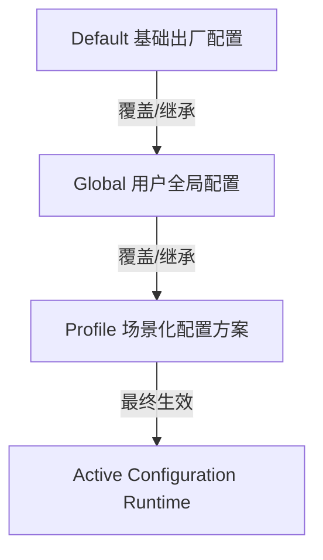

# 🚀 空间全景深度分析与 AI 智能文件整理系统 (Disk Space Panorama Analyzer)

[](https://www.python.org/downloads/)
[](https://pypi.org/project/PySide6/)
[](https://opensource.org/licenses/MIT)

> **专为 Windows 深度空间治理打造的高性能桌面客户端**：融合三阶段异步分层扫描引擎、SQLite 哈希持久化缓存、三级配置继承体系、**以 App / 工具链为原子单元的树状目录级 AI 智能整理**、以及具备快捷方式与注册表自动同步的智能迁移与安全回滚机制。

[English Documentation](./README.md) | [中文文档](./README_ZH.md)

---

## 🌟 核心特性与架构设计

### 1. ⚡ 三阶段异步非阻塞扫描引擎 (3-Phase Scanning)
- **阶段一（毫秒级全景快照）**：采用高效 `os.scandir` 流式遍历，瞬间呈现磁盘占用环形图/柱状图、类型分布与 **全局 Top 100 超大文件明细表**；
- **阶段二（并发分块哈希查重）**：
  - 首创 **“大小初筛 + 头部 8KB 样本哈希 + 并发全量哈希”** 三级过滤机制；
  - 内置 **SQLite 持久化哈希缓存**，二次扫描瞬间完成；
  - 深度防御 64 位超大文件字节溢出（支持 TB 级大文件安全校验）；
- **阶段三（智能汇总与全景治理报告）**：汇聚重复副本与启发式冗余项，可一键调用 OpenAI 兼容大模型生成专业的《磁盘存储全景深度分析与治理报告》。

---

### 2. 🌳 以 App / 工具链为原子单元的树状目录级智能整理 (App-Oriented Directory Grouping)
- **拒绝按扩展名机械拆分**：针对 `~/npm`、`~/.npm`、`node_modules`、`pip\cache`、`VS Code`、`Docker`、`WeChat` 等工具链或应用目录，**默认将其作为不可分割的整体处理单元（Atomic Group）**，统一生成归档规划；
- **树状目录规划预览 (`QTreeWidget`)**：
  - 直观展示原始路径、父目录、子目录相对层级与建议目标路径；
  - 节点展开/折叠，实时显示各目录下的文件总数、总大小、所属 App、识别依据、置信度与风险等级；
  - **父子节点级联勾选**：勾选父目录整体迁移并保持相对层级，部分子项勾选支持半选状态（`PartiallyChecked`）；
  - 提供 **“🛡️ 仅勾选安全推荐项”** 快捷决策；
- **软链接与挂载点识别**：智能检测 Windows NTFS Junction / Symlink，防止递归穿透；
- **“未识别工具/待分类”保守兜底**：无法可靠判定的目录强制标记为“需人工确认”，绝不强行推断或盲目移动。

---

### 3. 📦 智能迁移与全链路关联项同步 (Smart Migration & Junction Links)
- **NTFS 目录联接（Junction）**：跨盘迁移大型游戏或工作目录后，可自动创建 `mklink /J`，软件运行不受任何影响；
- **关联项同步探测**：自动扫描并安全更新桌面/开始菜单 `.lnk` 快捷方式目标，以及 `HKCU/HKLM` 注册表路径；
- **可回滚 Manifest 凭据**：所有迁移与归档操作自动在 `~/.disk_space_analyzer/archive_manifests/` 生成带有原路径/目标路径映射的 JSON 清单，支持一键还原。

---

### 4. ⚙️ 三级配置继承体系 (3-Tier Config Inheritance)

- 支持 `Default -> Global -> Profile` 级联覆盖，GUI 界面提供清晰的 **来源追踪徽标**（`[默认]` / `[全局]` / `[任务方案]`）。

---

### 5. 🛡️ 零卡顿架构与后台任务管理器 (Task Manager)
- 所有 I/O 密集型操作（扫描、哈希、归档、迁移、删除、AI 分析）均运行在独立后台 QThread 中；
- 主界面常驻 **⚡ 实时速度（MB/s）、处理进度与 ETA 剩余时间**；
- 支持随时 **⏸️ 暂停、▶️ 恢复、⏹️ 取消** 正在执行的任务；
- 软件退出时自动拦截活动任务，防止文件损坏。

---

## 📂 项目工程目录结构

```text
空间全景深度分析与冗余文件扫描/
├── app/
│   ├── config.py                  # 三级配置继承与持久化管理器
│   ├── core/
│   │   ├── ai_service.py          # OpenAI 兼容大模型客户端与分析引擎
│   │   ├── app_detector.py        # App/工具链识别与目录原子分组引擎
│   │   ├── cleaner.py             # 后台流式归档与安全删除 Worker
│   │   ├── hash_cache.py          # SQLite 3 级持久化哈希缓存数据库
│   │   ├── migrator.py            # 智能迁移、Junction 与快捷方式/注册表同步
│   │   ├── scanner.py             # 三阶段异步高性能全景扫描引擎
│   │   └── task_manager.py        # 全局任务调度器 (速度/ETA/暂停/恢复)
│   ├── ui/
│   │   ├── main_window.py         # 现代化侧边栏主窗口
│   │   ├── home_view.py           # 主控全景扫描看板与分阶段渲染视图
│   │   ├── organizer_view.py      # 文件整理与树状目录规划管理视图
│   │   ├── settings_view.py       # 配置中心 (继承方案管理与模型拉取)
│   │   ├── styles.py              # 现代化暗色主题 QSS 样式表
│   │   └── components/
│   │       ├── data_table.py      # O(1) 状态追踪高性能 Data Grid
│   │       ├── organize_dialog.py # QTreeWidget 目录树 AI 规划确认向导
│   │       └── task_manager_widget.py # 后台任务监控与日志排查弹窗
│   └── utils/
│       ├── file_helper.py         # 系统保护白名单、格式化与扩展名分类
│       └── logger.py              # 全局日志记录模块
├── tests/
│   ├── test_app_detector_and_grouping.py # 工具链原子分组与 ~/npm 验证
│   └── test_gui_dialogs.py        # Qt 离线组件与目录树预览验证
├── main.py                        # 应用程序启动入口
├── requirements.txt               # 项目依赖清单
├── README.md                      # English Documentation
└── README_ZH.md                   # 中文使用与架构文档
```

---

## 🚀 快速上手与运行

### 1. 环境准备
推荐使用 **Python 3.10 及以上** 版本：
```bash
# 1. 克隆或进入项目目录
cd "空间全景深度分析与冗余文件扫描"

# 2. 创建并激活虚拟环境 (可选)
python -m venv .venv
.venv\Scripts\activate

# 3. 安装依赖
pip install -r requirements.txt
```

### 2. 启动桌面客户端
```bash
python main.py
```

### 3. 运行自动化测试
```bash
# 验证 App 识别与 ~/npm 目录原子性测试
python tests/test_app_detector_and_grouping.py

# 验证 GUI 目录树交互组件
python tests/test_gui_dialogs.py
```

---

## 🤖 大模型 (LLM) 配置指南

在软件侧边栏进入 **“系统配置 (Settings)”**：
1. **Base URL**：输入 OpenAI 兼容服务端点（例如 `https://api.openai.com/v1` 或 DeepSeek / Local Ollama 兼容端点 `http://localhost:11434/v1`）；
2. **API Key**：填写对应的 API 访问令牌；
3. 点击 **“🔄 拉取可用模型”** 自动同步线上模型列表并选择（例如 `gpt-4o`, `deepseek-chat`）；
4. 点击 **“⚡ 测试连通性”** 校验成功后保存生效。
*(注：若未配置 API Key，系统会自动无缝切换至高精度的内置离线启发式规则引擎)*。

---

## 📄 开源许可证

本项目基于 [MIT License](LICENSE) 协议开源。
