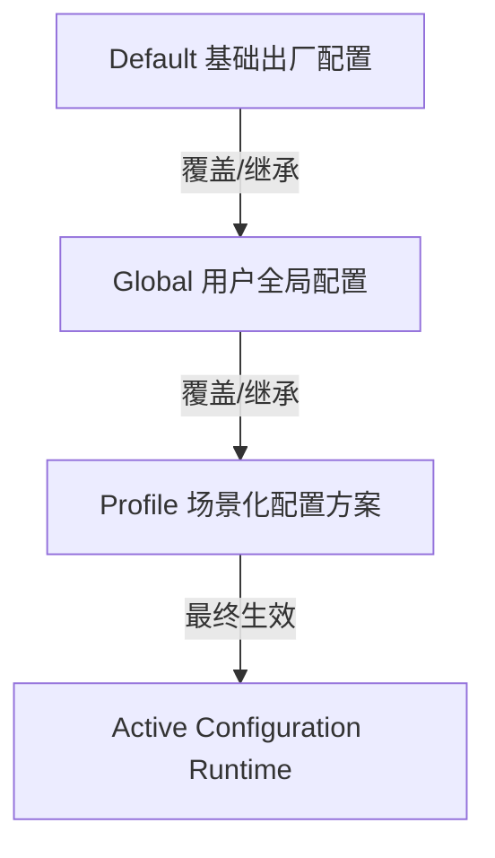

# 🚀 空间全景深度分析与 AI 智能文件整理系统 (Disk Space Panorama Analyzer)

[](https://www.python.org/downloads/)
[](https://pypi.org/project/PySide6/)
[](https://opensource.org/licenses/MIT)
[](https://www.microsoft.com/windows)
[](https://github.com/xuemingze/disk-space-analyzer)

> **专为 Windows 深度空间治理打造的高性能桌面客户端**：融合三阶段异步分层扫描引擎、SQLite 哈希持久化缓存、三级配置继承体系、**以 App / 工具链为原子单元的树状目录级 AI 智能整理**、具备**快捷方式与注册表自动同步的智能跨盘迁移与安全回滚机制**，以及**防超时与抗幻觉的端到端 AI 深度分析报告与自动化执行链路**。

[English Documentation](./README.md) | [中文文档](./README_ZH.md)

---

## 🌟 核心特性与架构设计

### 1. ⚡ 三阶段异步非阻塞扫描引擎 (3-Phase Scanning)
- **阶段一（毫秒级全景快照）**：采用高效 `os.scandir` 流式遍历，瞬间呈现磁盘占用环形图/柱状图、文件类型分布与 **全局 Top 100 超大文件明细表**；
- **阶段二（并发分块哈希查重）**：
  - 首创 **“大小初筛 + 头部 8KB 样本哈希 + 并发全量哈希”** 三级过滤机制；
  - 内置 **SQLite 持久化哈希缓存**，二次扫描瞬间完成；
  - 深度防御 64 位超大文件字节溢出，支持 TB 级大文件安全校验；
- **阶段三（智能汇总与全景治理报告）**：汇聚重复副本与启发式冗余项，可一键调用 OpenAI 兼容大模型生成专业的《磁盘存储全景深度分析与治理报告》。


---

### 2. 🛡️ 智能路径过滤与自定义忽略目录 (Ignore Folders Management)
- **多途径灵活配置**：支持通过文件夹选择对话框快速添加、手动输入绝对路径添加；
- **富交互管理**：列表项支持双击编辑、多选批量删除、一键清空及右键快捷菜单（快速复制完整路径、直接在 Windows 文件资源管理器中定位）；
- **实时规则生效**：扫描引擎启动时动态解析忽略规则，自动跳过命中目录及其子项，并统计跳过目录数，严密保护关键业务与个人隐私目录。

---

### 3. 🌳 以 App / 工具链为原子单元的树状目录级智能整理 (Atomic Grouping)
- **拒绝按扩展名机械拆分**：针对 `~/npm`、`~/.npm`、`node_modules`、`pip\cache`、`VS Code`、`Docker`、`WeChat`、`.gradle`、`.cargo` 等工具链或应用目录，**默认将其作为不可分割的原子整体处理单元（Atomic Group）**，统一生成归档规划；
- **10 列全景树状目录规划看板 (`QTreeWidget`)**：
  - 直观展示目录/文件单元、所属 App（附带 `[AI]` / `[离线规则]` 来源标识）、建议归档分类、目标规划路径、识别依据、数量/大小、置信度、风险等级、操作类型（清理/归档）以及**任务与报告审计关联（`R:report_id | T:task_id`）**；
  - **父子节点级联勾选**：勾选父目录整体迁移并保持相对层级，部分子项勾选支持半选状态（`PartiallyChecked`）；
  - 提供 **“🛡️ 仅勾选安全推荐项”** 快捷决策；
- **软链接与挂载点识别**：智能检测 Windows NTFS Junction / Symlink，防止递归穿透；
- **保守兜底策略**：无法可靠判定的目录强制标记为“未识别工具/待分类（需人工确认）”，绝不盲目移动。

---

### 4. 🤖 AI 深度分析与自动化执行链路 (AI Report & Auto Pipeline)
- **广泛的 API 兼容性**：支持 OpenAI、DeepSeek、MiniMax、Qwen、Local Ollama 等任意兼容 OpenAI 协议的大模型服务端点；
- **自动审计与关联追踪**：扫描完成后自动将带任务 ID 与时间戳的快照注入大模型，生成结构化 Markdown 报告并导出至本地（`AI深度分析报告_{id}.md`）；
- **报告驱动的执行清单提取**：点击“AI 自动处理”后，系统直接将导出的 Markdown 深度报告提交给大模型提取为结构化执行计划；
- **防幻觉与清洗引擎**：内置专用正则清洗器，强力剥离 `<think>...</think>` 思考过程和 Markdown 外壳，防御大模型格式漂移；
- **严苛字段级校验**：对缺少关键字段的响应实施强制拦截报错，杜绝残缺数据进入执行流；
- **指数退避与抖动重试机制**：网络波动与 ReadTimeout 自动重试（45s 阶梯超时 + Jitter 延迟退避），确保长文本请求高可靠性。

---

### 5. 📦 智能迁移、Junction 软联接与安全回滚机制 (Smart Migration)
- **NTFS 目录联接（Junction）**：跨盘迁移大型应用或游戏目录后，自动创建 `mklink /J`，软件运行完全无感知；
- **关联项同步探测与勾选更新**：
  - 自动扫描并展示关联的桌面与开始菜单快捷方式（`.lnk`）；
  - 扫描关联的 `HKCU` / `HKLM` 注册表路径，支持用户在对话框中逐项勾选确认后安全更新；
- **原子自动回滚与 Manifest 凭证**：
  - 迁移过程如遇异常中断，自动触发回滚恢复已迁移文件；
  - 所有操作自动在 `~/.disk_space_analyzer/archive_manifests/` 生成带有原路径/目标路径映射的 JSON 清单，支持一键还原。

---

### 6. ⚙️ 三级配置继承体系 (3-Tier Config Inheritance)

- 支持 `Default -> Global -> Profile` 级联覆盖与场景切换；
- GUI 界面提供清晰的 **配置来源追踪徽标**（`[默认]` / `[全局]` / `[任务方案]`）。

---

### 7. 🛡️ 零卡顿架构与后台任务管理器 (Task Manager)
- **全局统一任务中心**：完整记录扫描、哈希、汇总、大模型分析的各子阶段进度流转，并展示详尽的成功/失败/跳过计数统计。
- 所有 I/O 密集型操作（扫描、哈希、归档、迁移、删除、AI 分析）均运行在独立后台 `QThread` 中；
- 主界面常驻 **⚡ 实时速度（MB/s）、处理进度与 ETA 剩余时间**；
- 支持随时 **⏸️ 暂停、▶️ 恢复、⏹️ 取消** 正在执行的任务；
- 软件退出时自动拦截活动任务，防止文件损坏。

---


### 8. 🗂️ 归档快照管理与一键清理 (Snapshot Management)
- **历史归档管理器**：支持快照的多选删除、生命周期状态展示与时间倒序排列；
- **一键安全清理**：自动过滤并清理已完全回滚或已取消的废弃快照，完美避开正在活跃引用的任务；
- **领域事件增量刷新**：快照删除或回滚后，只局部刷新关联的表格与视图，绝不破坏用户当前的勾选、排序与筛选状态。

### 9. 🎨 高 DPI 自适应与精准 AI 洞察 (UI/UX & AI Extraction)
- **流式自适应布局**：彻底消除硬编码高度，完美支持 125%、150% 甚至更高的 Windows 字体缩放；
- **精准的 AI 文本切片引擎**：根据页面职责（全景图、重复文件、Top100大文件），只萃取展示对应大模型报告中的特定段落，彻底消除信息冗余与刷屏。

## 📂 项目工程目录结构

```text
空间全景深度分析与冗余文件扫描/
├── app/
│   ├── config.py                  # 三级配置继承与持久化管理器 (Default/Global/Profile)
│   ├── core/
│   │   ├── ai_service.py          # OpenAI 兼容大模型客户端、报告生成与结构清洗引擎
│   │   ├── app_detector.py        # App/工具链识别与目录原子分组引擎
│   │   ├── cleaner.py             # 后台流式归档与安全删除 Worker
│   │   ├── hash_cache.py          # SQLite 3 级持久化哈希缓存数据库
│   │   ├── migrator.py            # 智能迁移、Junction 联接、快捷方式/注册表同步与回滚
│   │   ├── scanner.py             # 三阶段异步高性能全景扫描引擎 (支持忽略路径过滤)
│   │   └── task_manager.py        # 全局任务调度器 (速度/ETA/暂停/恢复)
│   ├── ui/
│   │   ├── main_window.py         # 现代化侧边栏主窗口
│   │   ├── home_view.py           # 主控全景扫描看板、报告面板与分阶段渲染视图
│   │   ├── organizer_view.py      # 文件整理与树状目录规划管理视图
│   │   ├── settings_view.py       # 配置中心 (三层方案管理、模型拉取与忽略目录维护)
│   │   ├── styles.py              # 现代化暗色主题 QSS 样式表
│   │   └── components/
│   │       ├── data_table.py      # O(1) 状态追踪高性能 QTableView
│   │       ├── migration_dialog.py# 智能迁移与注册表/快捷方式同步向导
│   │       ├── organize_dialog.py # QTreeWidget 10 列目录树 AI 规划确认向导
│   │       └── task_manager_widget.py # 后台任务监控与日志排查弹窗
│   └── utils/
│       ├── file_helper.py         # 系统保护白名单、格式化与扩展名分类
│       └── logger.py              # 全局多级别日志记录模块
├── tests/
│   ├── test_ai_service_and_pipeline.py  # AI 响应清洗、字段校验与重试机制测试
│   ├── test_app_detector_and_grouping.py# 工具链原子分组与 ~/npm 规则验证
│   ├── test_gui_dialogs.py             # Qt 离线组件与目录树预览验证
│   ├── test_null_safety.py             # 空值与边界安全防护测试
│   └── test_settings_and_ignore_folders.py # 忽略路径持久化与来源继承测试
├── main.py                        # 应用程序启动入口
├── requirements.txt               # 项目依赖清单
├── README.md                      # English Documentation
└── README_ZH.md                   # 中文使用与架构文档
```

---

## 🚀 快速上手与运行

### 1. 环境准备
推荐使用 **Python 3.10 及以上** 版本：
```bash
# 1. 克隆项目仓库
git clone https://github.com/xuemingze/disk-space-analyzer.git
cd disk-space-analyzer

# 2. 创建并激活虚拟环境 (推荐)
python -m venv .venv
.venv\Scripts\activate

# 3. 安装依赖包
pip install -r requirements.txt
```

### 2. 启动桌面客户端
```bash
python main.py
```

### 3. 运行自动化测试套件
```bash
pytest tests/ -v
```

---

## 🤖 大模型 (LLM) 配置指南

在软件侧边栏进入 **“系统配置 (Settings)”**：
1. **Base URL**：输入 OpenAI 兼容服务端点（例如 `https://api.openai.com/v1`、DeepSeek 或 Local Ollama 端点 `http://localhost:11434/v1`）；
2. **API Key**：填写对应的 API 访问令牌；
3. 点击 **“🔄 拉取可用模型”** 自动同步线上模型列表并选择（如 `gpt-4o`, `deepseek-chat`, `MiniMax-Text-01` 等）；
4. 点击 **“⚡ 测试连通性”** 校验成功后保存生效。
*(注：若未配置 API Key，系统会自动无缝切换至高精度的内置离线启发式规则引擎)*。

---

## 📄 开源许可证

本项目基于 [MIT License](LICENSE) 协议开源。
